# 🐉 D&D Board

Aplicación web fullstack para gestionar **tableros y campañas de Dungeons & Dragons**. Permite a los jugadores moverse por un mapa en cuadrícula, gestionar personajes con estadísticas y al dungeon master administrar la partida en tiempo real.

Desarrollada como proyecto de fin de ciclo con un stack moderno:

- **Frontend**: Angular 21 (Standalone Components, Signals, Tailwind CSS)
- **Backend**: Laravel 13 (API REST, Sanctum, Google OAuth)
- **Infraestructura**: Docker + Docker Compose, desplegada en VPS propio

**Producción**: [http://polidnd.chickenkiller.com:8001](http://polidnd.chickenkiller.com:8001)

---

## � Usuarios de Prueba

Los siguientes usuarios están disponibles tanto en **local** como en **producción** (creados automáticamente por el seeder al hacer `make install` / `make install-prod`):

| Rol           | Email           | Contraseña |
| ------------- | --------------- | ---------- |
| Administrador | `admin@dnd.com` | `password` |
| Jugador       | `test@dnd.com`  | `password` |

> Además se generan 10 usuarios aleatorios con contraseña `password` para simular una partida con varios jugadores.

---

## 📸 Capturas de Pantalla

### Login

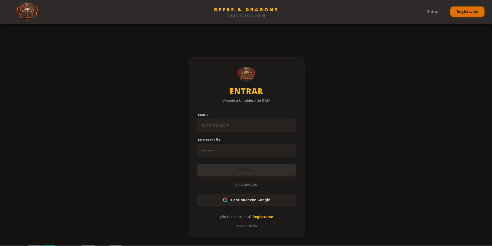

### Registro

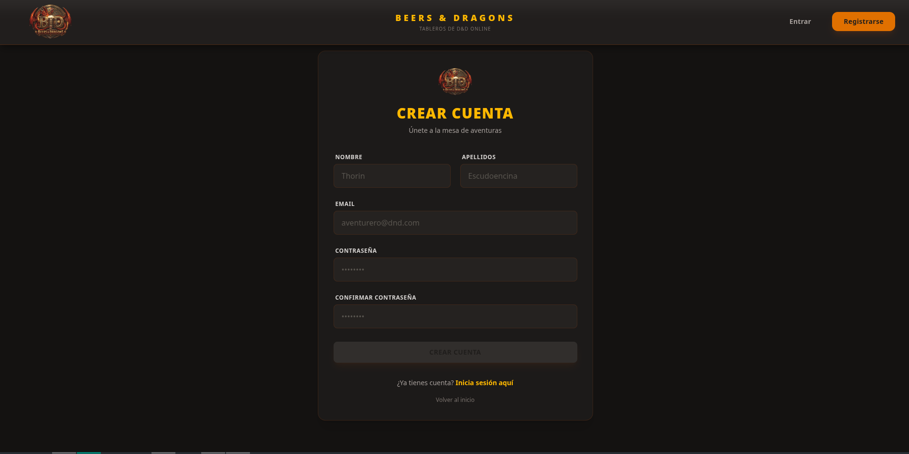

### Dashboard

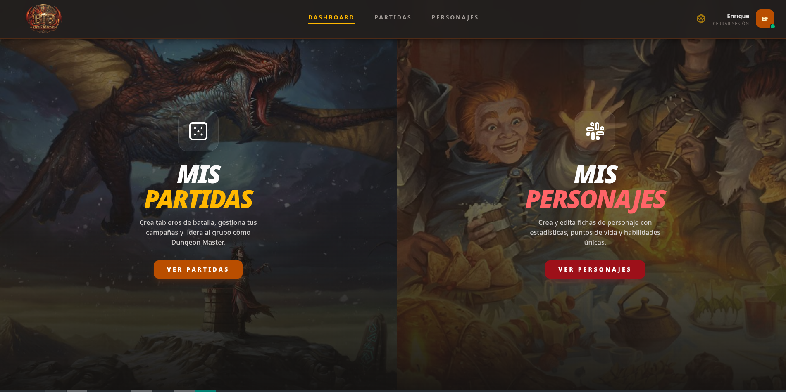

### Mis Partidas

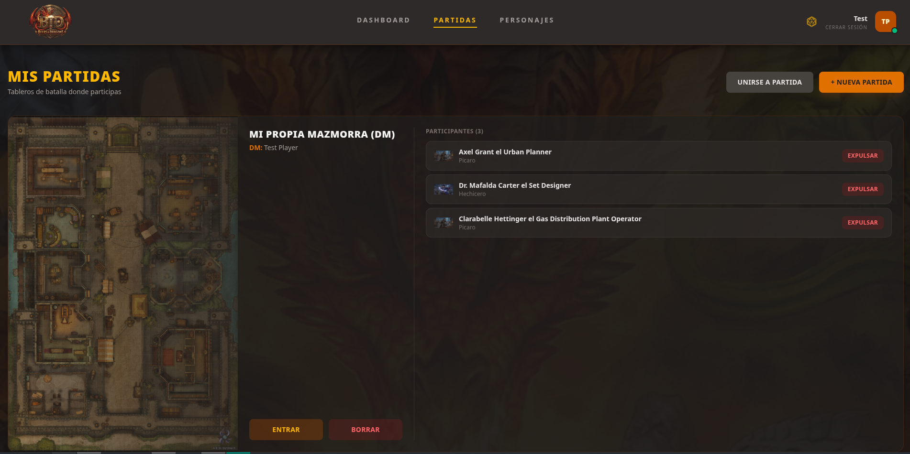

### Mis Personajes

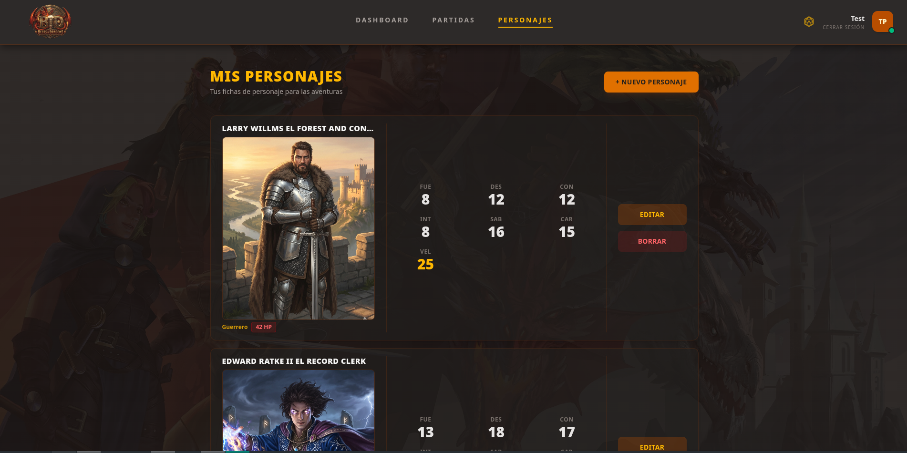

### Tablero de juego

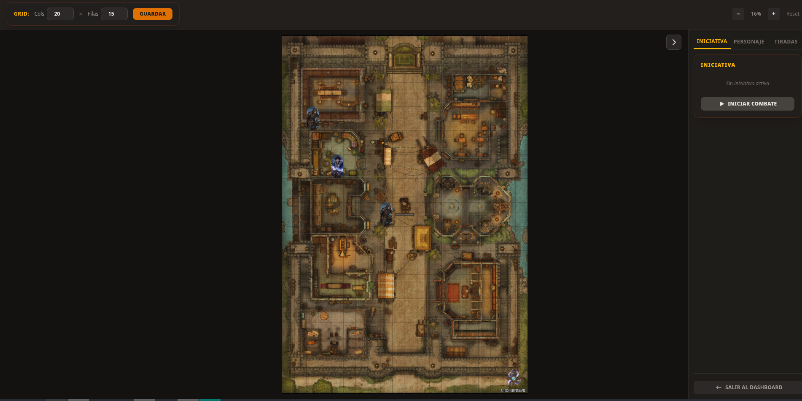

### Estadísticas (Admin)

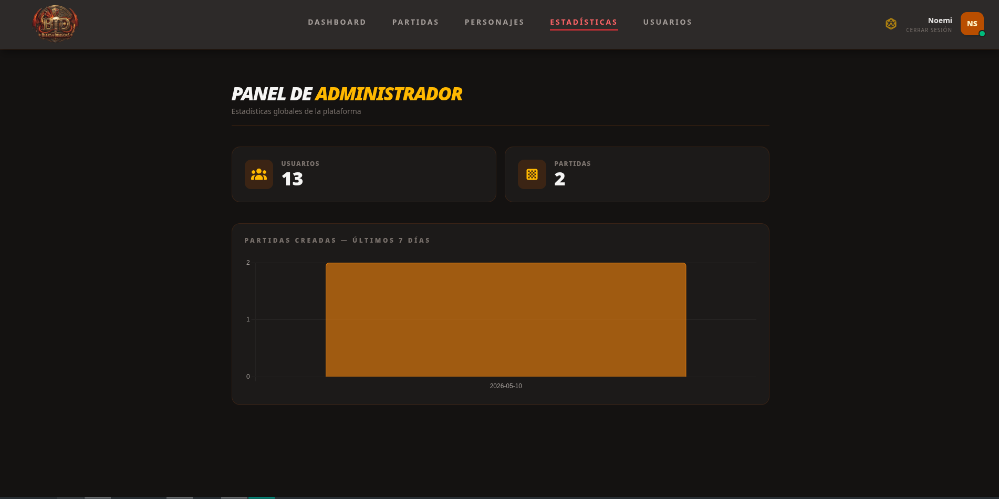

### Gestión de usuarios (Admin)

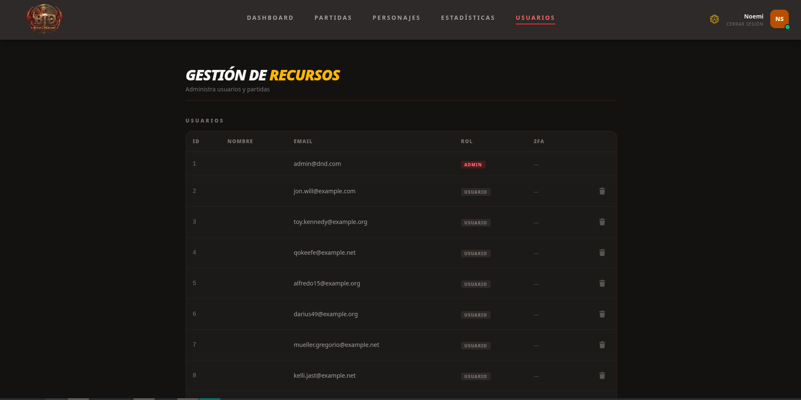

---

## 🗺 Mapa Web

### Vista de invitado

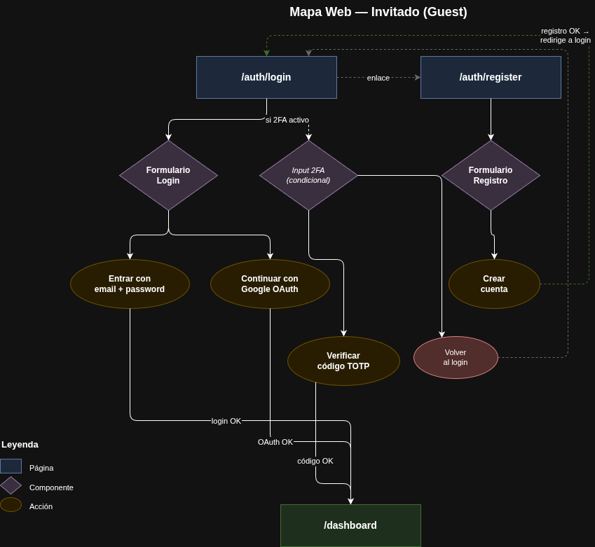

### Vista de jugador

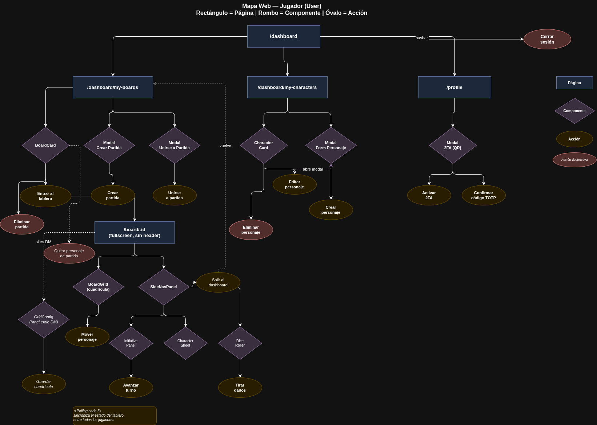

### Vista de administrador

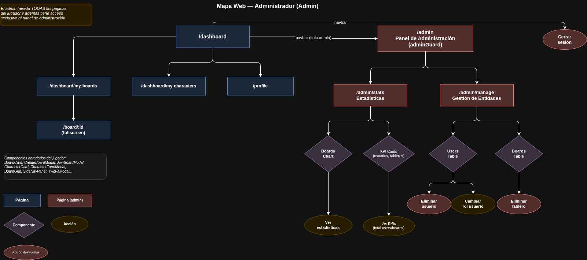

---

## ✨ Características Destacadas

### Google OAuth

El login con Google usa **Socialite** en Laravel con flujo stateless. Al hacer clic en "Acceder con Google":

1. El frontend redirige directamente a `GET /api/auth/google` — el backend genera la URL de Google y redirige al usuario.
2. Google autentica y devuelve al backend vía callback (`GET /api/auth/google/callback`).
3. El backend crea o encuentra al usuario, genera un **token Sanctum** y redirige al frontend con la sesión codificada en la URL: `/login?session=<json_codificado>`.
4. El `AuthService` en Angular detecta el parámetro `session` al inicializarse, parsea el JSON, guarda el token y redirige al dashboard.

> Se eligió este flujo (redirect + query param) en lugar de una popup con `postMessage` para evitar complejidad adicional y porque es compatible con cualquier SPA sin necesidad de service workers ni canales de comunicación entre ventanas.

---

### Google 2FA (TOTP)

La autenticación de doble factor sigue el estándar TOTP (RFC 6238), compatible con **Google Authenticator**, **Authy** y similares:

**Activación** (desde el perfil):

1. El backend genera una `secret key` aleatoria y una URL de QR — el frontend la renderiza mediante la API pública de `qrserver.com`.
2. El usuario escanea el QR con su app y confirma con un código de 6 dígitos.
3. El backend verifica el código contra el secret y, solo si es válido, persiste el secret encriptado en la base de datos.

**Login con 2FA activo**:

1. El backend responde al login normal con `{ require_2fa: true, temp_user_id }` — sin emitir ningún token todavía.
2. El frontend muestra el formulario de código TOTP.
3. Al confirmar, el backend verifica el código y emite el token Sanctum definitivo.

---

### Sincronización del Tablero por Polling

El estado del tablero (posiciones de personajes, turno activo, iniciativa) se sincroniza entre todos los jugadores mediante **HTTP polling cada 5 segundos** en lugar de WebSockets.

**¿Por qué polling y no WebSockets?**

- WebSockets añaden complejidad de infraestructura significativa (servidor de websockets separado, broadcasting, canales, etc.).
- Los turnos de D&D son inherentemente lentos — un retraso de 5 segundos es imperceptible en el contexto de una partida de rol.
- La API REST ya existente se reutiliza sin añadir ninguna dependencia extra, lo que hace la solución más mantenible y fácil de desplegar.

El polling se gestiona en `BoardPage` con un `interval` de RxJS vinculado al ciclo de vida del componente mediante `takeUntilDestroyed()`, garantizando que se detiene automáticamente al salir del tablero.

---

## 📄 Documentación

| Documento                                                  | Descripción                          |
| ---------------------------------------------------------- | ------------------------------------ |
| [Guía de Estilos](docs/guia-estilos.md)                    | Paleta, tipografía, componentes UI   |
| [Patrones de Diseño Web](docs/patrones-diseno-web.md)      | Patrones aplicados con justificación |
| [Casos de Uso](docs/uml/casos-de-uso.md)                   | 27 casos de uso con precondiciones   |
| [Diagrama de Clases](docs/uml/diagrama-clases.md)          | Backend y frontend                   |
| [Modelo de Base de Datos](docs/uml/modelo-base-datos.puml) | Esquema completo                     |

---

## 🛠 Requisitos Previos

- **Docker** + **Docker Compose v2**
  - Windows/Mac: [Docker Desktop](https://www.docker.com/products/docker-desktop/)
  - Linux: Docker Engine + plugin `docker-compose-v2`
- **Git**
- **Make** preinstalado en Linux/Mac; en Windows usar WSL (Opcional)

---

## 📁 Estructura

```
.
├── Makefile                  # Comandos de gestión
├── docker-compose.yml        # Orquestación de servicios
├── backend/dnd-board/        # API Laravel
│   ├── .env.example          # Config local
│   ├── .env.example.prod     # Config producción
│   └── docker/entrypoint.sh  # Arranca PHP-FPM, espera MySQL y migra
└── frontend/dnd-board-front/ # SPA Angular 21
    └── Dockerfile            # Multi-stage build con nginx
```

---

## 🚀 Despliegue

Todos los comandos se ejecutan desde la **raíz del repositorio**.

---

### Local con Make (recomendado)

```bash
make install
```

Esto hace todo automáticamente:

1. Copia `backend/dnd-board/.env.example` → `backend/dnd-board/.env`
2. Construye las imágenes Docker (frontend con `BUILD_CONFIG=development`, que apunta a `localhost:8000`)
3. Levanta los contenedores en segundo plano
4. El `entrypoint.sh` del contenedor `app` espera a que MySQL esté listo y ejecuta `migrate + seed` automáticamente

| Servicio      | URL                   |
| ------------- | --------------------- |
| Backend (API) | http://localhost:8000 |
| Frontend      | http://localhost:8001 |
| MySQL         | localhost:3307        |

---

### Local sin Make (manual)

Si no tienes `make` disponible, ejecuta estos comandos en orden desde la raíz del repositorio:

```bash
# 1. Copiar la configuración de entorno local
cp backend/dnd-board/.env.example backend/dnd-board/.env

# 2. Construir las imágenes (el ARG BUILD_CONFIG=development apunta el frontend a localhost:8000)
BUILD_CONFIG=development docker compose --profile prod build

# 3. Levantar todos los contenedores en segundo plano
BUILD_CONFIG=development docker compose --profile prod up -d
```

> El `entrypoint.sh` del contenedor `app` se encarga automáticamente de esperar a MySQL y ejecutar las migraciones. Puedes seguir el progreso con `docker compose logs -f app`.

---

### Producción (VPS)

Con Make:

```bash
make install-prod
```

Sin Make:

```bash
cp backend/dnd-board/.env.example.prod backend/dnd-board/.env
docker compose --profile prod build
docker compose --profile prod up -d
```

Igual que el despliegue local pero usando `.env.example.prod`, que configura las URLs del dominio y `APP_ENV=production`. El frontend se construye con `BUILD_CONFIG=production` (por defecto en el `docker-compose.yml`).

| Servicio      | URL                                   |
| ------------- | ------------------------------------- |
| Backend (API) | http://polidnd.chickenkiller.com:8000 |
| Frontend      | http://polidnd.chickenkiller.com:8001 |

---

### Desarrollo — Backend Docker + Frontend live

La opción más habitual para desarrollar en el frontend: el backend y la base de datos corren en Docker (sin reconstruir imagen), y el frontend se sirve con `ng serve` para tener hot-reload.

```bash
# Terminal 1 — levantar solo backend + DB
make up-back
# o sin make:
docker compose up -d

# Terminal 2 — frontend con hot-reload
cd frontend/dnd-board-front
ng serve
```

El frontend en `ng serve` corre en `http://localhost:4200` y usa `environment.development.ts`, que ya apunta a `http://localhost:8000/api`.

> ⚠️ Si usas login con Google en este modo, necesitas cambiar `FRONTEND_URL=http://localhost:4200` en `backend/dnd-board/.env`, ya que el callback de OAuth redirigirá al puerto 4200.

---

### Desarrollo — Todo sin Docker (php artisan serve)

Para trabajar con recarga completa tanto en backend como en frontend, sin necesidad de Docker. Requiere tener instalados localmente **PHP**, **Composer** y **MySQL** (o **Node.js/npm**).

```bash
# Terminal 1 — Backend Laravel
cd backend/dnd-board
cp .env.example .env                  # si no existe aún
# Edita .env: cambia DB_HOST=127.0.0.1 y las credenciales de tu MySQL local
composer install
php artisan key:generate
php artisan migrate --seed
php artisan serve                     # arranca en http://localhost:8000

# Terminal 2 — Frontend Angular
cd frontend/dnd-board-front
npm install
ng serve                              # arranca en http://localhost:4200
```

> En este modo `environment.development.ts` ya apunta a `localhost:8000`, así que el frontend funciona sin cambios. Recuerda ajustar también `FRONTEND_URL=http://localhost:4200` y `GOOGLE_REDIRECT_URI` en el `.env` si necesitas OAuth con Google.

---

## 📝 Referencia de Comandos

| Comando             | Descripción                                                  |
| ------------------- | ------------------------------------------------------------ |
| `make install`      | Primera instalación local (Docker completo)                  |
| `make install-prod` | Primera instalación en VPS                                   |
| `make up`           | Levanta todos los servicios sin reconstruir                  |
| `make up-back`      | Solo backend + DB (para desarrollar con `ng serve`)          |
| `make down`         | Apaga todos los contenedores                                 |
| `make logs`         | Logs en tiempo real del backend                              |
| `make logs-front`   | Logs en tiempo real del frontend                             |
| `make logs-db`      | Logs en tiempo real de MySQL                                 |
| `make migrate`      | Ejecuta migraciones manualmente                              |
| `make seed`         | Ejecuta seeders manualmente                                  |
| `make shell`        | Terminal bash dentro del contenedor Laravel                  |
| `make cache`        | Limpia la caché de Laravel                                   |
| `make clean`        | Limpia caché + apaga contenedores                            |
| `make fclean`       | Borrado total (contenedores + imágenes + volúmenes + `.env`) |
| `make reset`        | `fclean` + `install` (local desde cero)                      |
| `make reset-prod`   | `fclean` + `install-prod` (VPS desde cero)                   |

---

## ⚠️ Solución de Problemas

- **Puerto 8000/8001 ocupado**: Para el servicio que lo use antes de ejecutar `make install`.
- **Permisos en Linux** (`Permission Denied` en `storage/`): El `entrypoint.sh` aplica `chown` automáticamente. Si persiste, ejecuta `sudo chown -R $USER:$USER backend/dnd-board/storage`.
- **Error de conexión a MySQL en el arranque**: El `entrypoint.sh` espera automáticamente a que MySQL esté listo con `nc -z db 3306` antes de migrar. Si el error persiste tras el arranque, revisa los logs con `make logs-db`.
- **`fclean` avisa de imágenes en uso**: Normal si otros proyectos Docker en la misma máquina usan `mysql` o `nginx`. Los contenedores y volúmenes de este proyecto sí se borran correctamente.
