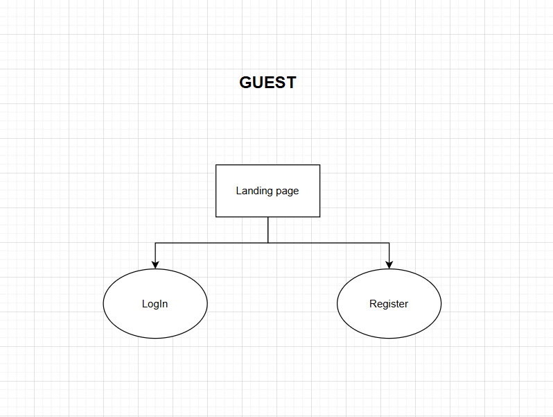
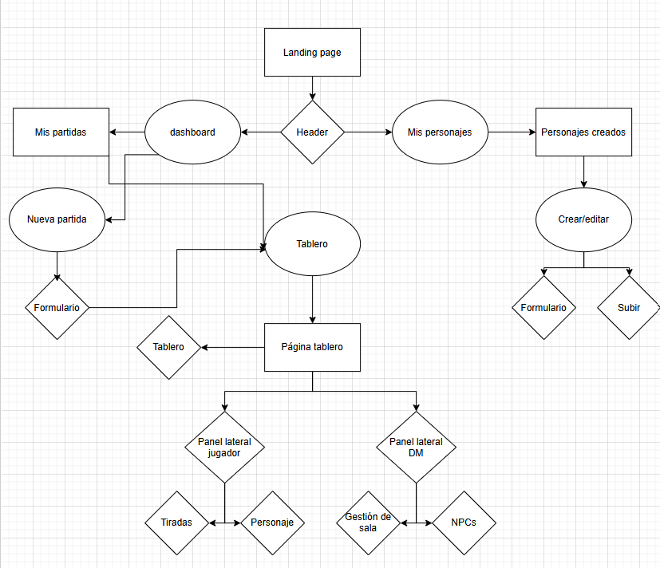
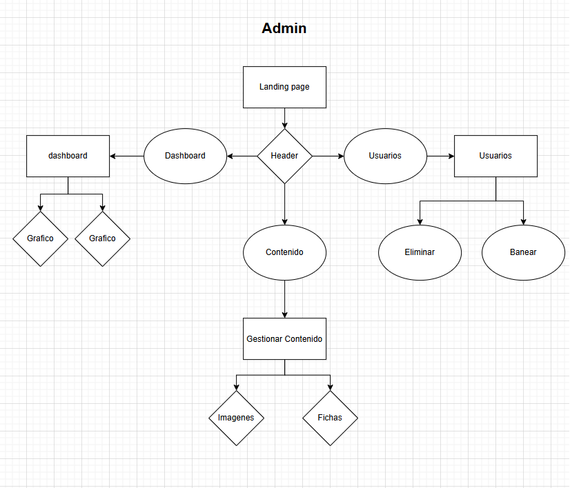
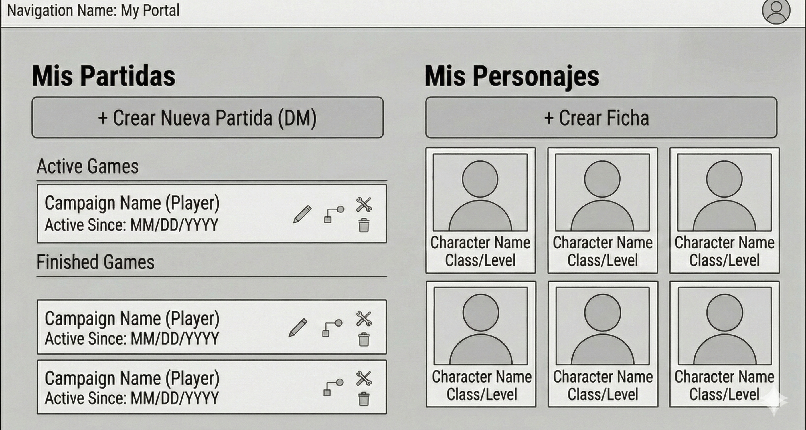

# Anteproyecto: Tablero Virtual y Gestor de Partidas para Dungeons & Dragons (D&D)

## 1. Descripción General

El proyecto consiste en el desarrollo de una aplicación web interactiva diseñada para la gestión y simulación de partidas del juego de rol Dungeons & Dragons (D&D). A nivel de arquitectura de usuarios, el sistema distingue claramente entre dos grandes grupos:

Usuarios Normales (Jugadores y Dungeon Masters - DMs): Son los usuarios que interactúan con el juego en sí. Un usuario normal puede participar en unas partidas como jugador (controlando su personaje) y crear otras partidas donde actuará como DM (dirigiendo la historia y controlando el tablero).

Administradores del Sistema: Personal de mantenimiento de la plataforma. No participan en las partidas, sino que disponen de un panel de control global para administrar cuentas, moderar contenido, supervisar el rendimiento del servidor y gestionar las reglas generales de la aplicación.

El objetivo es proporcionar una herramienta integral que mantenga la experiencia del juego clásico para los usuarios, al mismo tiempo que ofrece un entorno seguro, moderado y escalable administrado por el equipo de la plataforma.

## 2. Arquitectura y Tecnologías

El proyecto sigue una arquitectura modular y escalable basada en la separación del cliente y el servidor:

Tecnologías Principales:

Frontend (Cliente): Angular/Vue. Encargado de la interfaz de usuario (UI), el renderizado dinámico del tablero, la lógica de tiradas de dados y los paneles de gestión. (No se ha decidido tecnología de frontend todavía porque no se si voy a ver suficiente Vue durante las prácticas)

Backend (Servidor/API): Laravel (PHP). Responsable de la lógica de negocio, autenticación, API REST, y gestión de permisos/roles.

Infraestructura: Docker. Contenerización de todos los servicios para garantizar un entorno de desarrollo y despliegue estandarizado.

## 3. Funcionalidades Principales

Las funcionalidades se dividen en tres bloques según el rol que ejerza el usuario en ese momento:

### 3.1. Funcionalidades del Jugador (Usuario Normal)

Gestión de Perfil y Fichas: Registro, inicio de sesión y subida de fichas personalizadas para representar a sus personajes, definiendo atributos básicos.

Tablero Interactivo: Visualización del mapa de la partida, con capacidad para mover sus fichas (tokens) respetando las restricciones de movimiento (cálculo algorítmico de distancias en la cuadrícula).

Motor de Tirada de Dados: Selector interactivo de tipo de dado (D4, D6, D8, D20, etc.) y cantidad, con cálculo automático de resultados y suma total.

### 3.2. Funcionalidades del Dungeon Master - DM (Usuario Normal)

Creación y Gestión de Partidas: Creación de salas de juego, configuración de dimensiones del tablero y subida de mapas de fondo específicos para su campaña.

Gestión de la Sala: Asignación de usuarios normales a su partida (invitaciones), con la capacidad de expulsar jugadores de su sala.

Control Absoluto del Tablero: Capacidad para colocar NPCs, enemigos y objetos en el mapa. Puede modificar la posición de cualquier ficha y ajustar reglas locales (como rangos de movimiento específicos para esa sesión).

### 3.3. Funcionalidades del Administrador del Sistema

Gestión Global de Usuarios: CRUD completo de todos los usuarios registrados. Capacidad para suspender cuentas, banear  o resetear contraseñas.

Moderación de Contenido: Panel para revisar todas las imágenes y fichas subidas al servidor por los usuarios normales. Aprobación/rechazo para evitar contenido inapropiado o que incumpla los términos de servicio.

Configuración del Servidor: Definición de parámetros globales (ej. tamaño máximo de imagen permitida, límite de tokens por usuario, dimensiones máximas de tableros).

Dashboard de Monitorización y Estadísticas: Panel visual con gráficos sobre número de partidas activas/finalizadas, carga del servidor, reportes de acciones y logs de auditoría general. Capacidad de observar cualquier partida en curso por motivos de moderación.

## 4. Esqueleto estructura de la Base de Datos

El modelo relacional en MySQL contará con las siguientes tablas principales:

- users: Almacena la información de los usuarios y su rol de sistema (ej. role: 'normal' | 'admin').

- boards (Partidas): Información de las salas. Incluye un campo dm_id (clave foránea a users) para identificar qué usuario normal es el dueño/DM de esa partida.

- board_user: Tabla pivote que relaciona qué usuarios (Jugadores) tienen acceso a qué partidas (boards).

- characters: Fichas (personajes) creadas/subidas por los usuarios.

- board_character: Representa la instancia y posición exacta (x, y) de una ficha dentro de un tablero específico.

- rolls: Registro histórico de las tiradas realizadas.

## 5. Diseño de la Interfaz (UI/UX)

Vista de Tablero (Jugadores y DMs): Diseño inmersivo enfocado en maximizar el área del mapa. Los jugadores tendrán un panel lateral básico (chat, dados, su personaje). El DM tendrá en esa misma vista herramientas extra (capas ocultas, catálogo de enemigos, controles de la partida).

Página de Gestión Personal (Usuario Normal): Un panel sencillo donde el usuario ve sus partidas (donde es jugador y donde es DM) y su galería de fichas.

Dashboard de Administración (Administradores): Interfaz estrictamente administrativa (fuera del entorno inmersivo de juego). Menú lateral (Sidebar) para navegación rápida, tablas de datos con filtros (usuarios, fichas reportadas) y gráficos de rendimiento global.

## 6. Posibles Ampliaciones

Debido a la arquitectura modular planteada, el proyecto queda preparado para las siguientes mejoras futuras:

Sincronización en Tiempo Real: Implementación de WebSockets (ej. Laravel Reverb o Pusher).

Comunicación Integrada: Chat de partida (texto y tiradas de dados públicas).

Sistema de Combate Automático: Integración de un sistema formal de turnos y seguimiento de puntos de vida (HP).

Editor de Mapas Avanzado: Creación de mapas directamente en el navegador ("Fog of War", colocación de muros).

Almacenamiento Cloud: Integración con AWS S3 para la gestión de assets.

## 7. Diagramas web:

### Diagrama mapa web invitado

### Diagrama mapa web usuario normal

### Diagrama mapa web usuario administrador

## 8. Prototipos:

### Prototipo página tablero

### Prototipo página usuario normal

### Prototipo página usuario administrador

