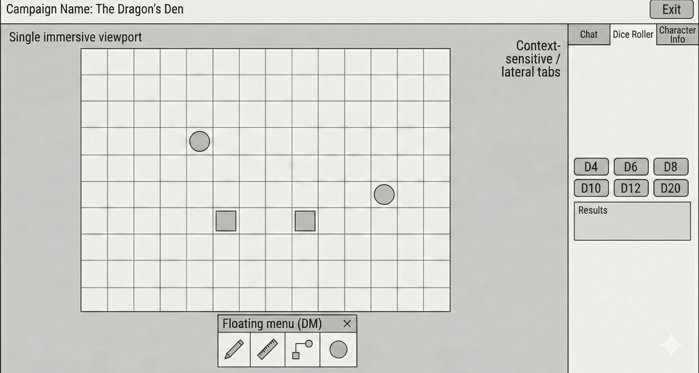
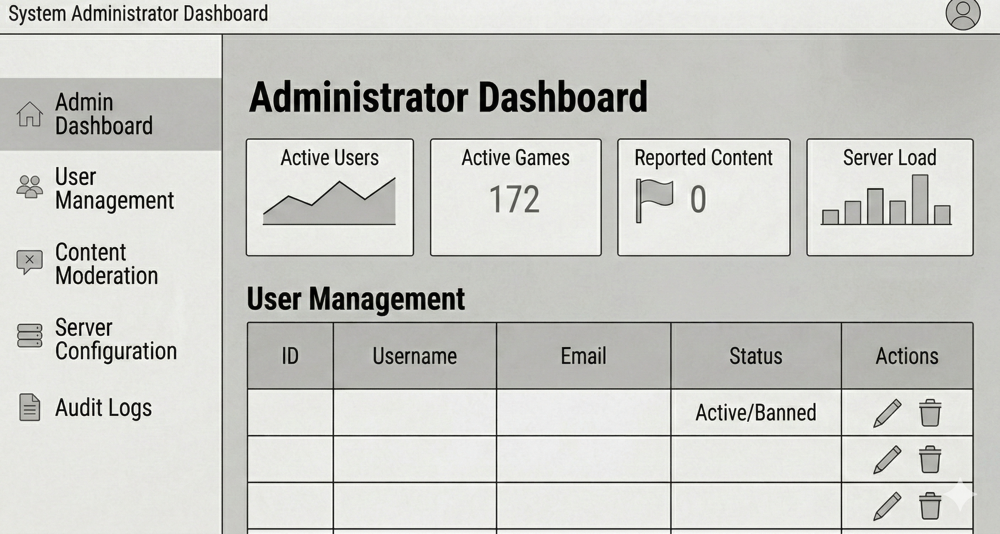

# Prototipos de Baja Fidelidad

Estos prototipos se elaboraron durante la fase de **anteproyecto** como primera aproximación visual de la aplicación. Representan la idea inicial de las vistas principales antes de comenzar el desarrollo.

Se han mantenido en la documentación para que se pueda observar la **evolución del diseño** desde la concepción hasta el producto final.

## Cambios respecto al diseño final

Durante el desarrollo, el diseño se simplificó considerablemente respecto a estos prototipos iniciales:

- **Reducción de complejidad**: se eliminaron vistas y elementos que añadían ruido sin aportar valor real al usuario.
- **Mejora de UX**: se reorganizaron flujos de navegación para que fueran más directos e intuitivos.
- **Mejora de UI**: se adoptó una estética más limpia y cohesiva con Tailwind CSS, priorizando la legibilidad y el contraste.
- **Funcionalidades replanteadas**: algunas ideas del prototipo se descartaron o fusionaron con otras vistas para evitar fragmentación innecesaria.

## Prototipos

### Vista de usuario (jugador)

### Vista del tablero de juego

### Vista de administrador

